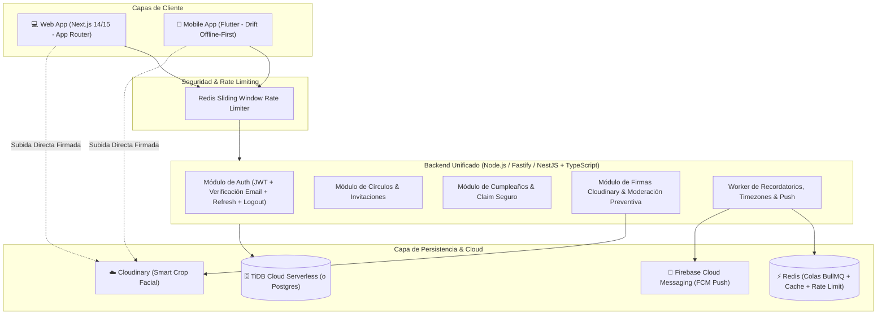
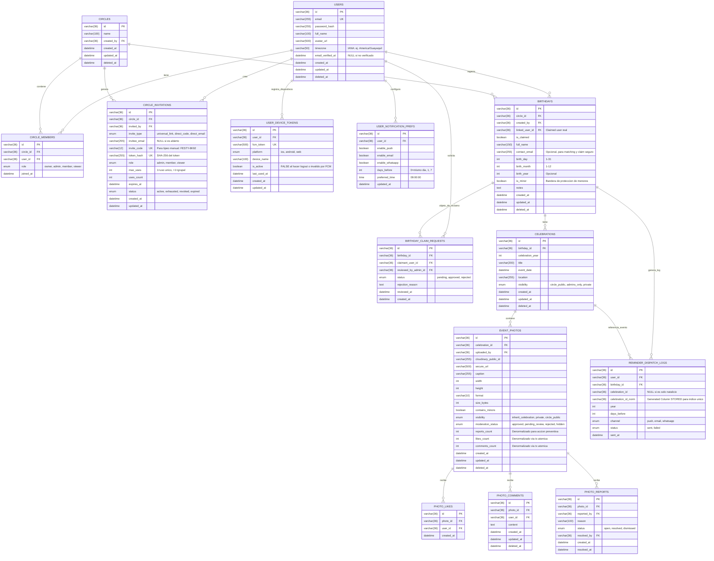
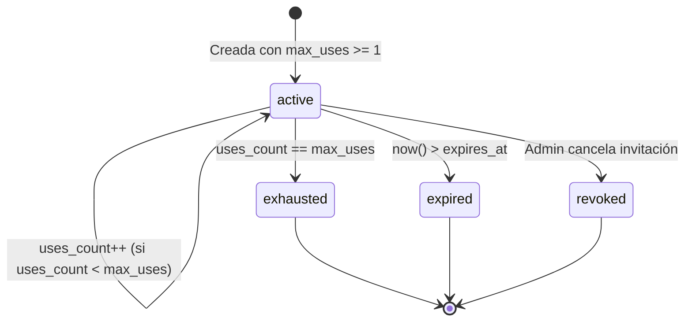

# Especificación Técnica y Arquitectura de la Plataforma Festy (v2.3)

Documento maestro de arquitectura y diseño de ingeniería para la plataforma **Festy**, un sistema colaborativo de calendario de cumpleaños y galería de fotos por eventos con clientes **Web** y **Móvil (Flutter)**, persistencia en **TiDB** (con migración transparente a PostgreSQL vía Drizzle ORM) y gestión multimedia optimizada en **Cloudinary**.

---

## 1. Tensión de Decisión: TiDB Serverless vs PostgreSQL

| Dimensión | **TiDB Cloud Serverless** | **PostgreSQL (Supabase / Neon / RDS)** |
| :--- | :--- | :--- |
| **Costo inicial / Free Tier** | **5 GiB almacenamiento + 50M Request Units/mes gratis permanente**. Insuperable para arrancar con \$0 de costo. | 500 MB (Supabase) o 0.5 GiB / 190h cómputo (Neon). Se alcanza el límite más rápido. |
| **Alineación con el Dominio** | Compatible con MySQL 5.7/8.0. La matemática de recurrencias de fechas y cálculo de días restantes debe resolverse en código. | **Óptima**: Tipos nativos `interval`, `tstzrange`, funciones avanzadas de fechas y `generate_series`. |
| **Aislamiento y Seguridad** | Sin Row Level Security (RLS) nativo; el aislamiento entre círculos debe forzarse 100% en middlewares/guards del backend. | **RLS nativo**: Políticas declarativas a nivel de motor de BD para restringir acceso por círculo. |
| **Extensiones** | Limitadas al ecosistema NewSQL de PingCAP. | Ecosistema rico: `pg_cron` (jobs dentro de la BD), `pgvector` (búsqueda visual futura). |
| **Estrategia Festy** | **Drizzle ORM desacoplado**: Arrancamos con **TiDB** para garantizar \$0 de costo en desarrollo y arranque. Dado que la capa de datos usará Drizzle con tipado estricto, la migración a PostgreSQL si el proyecto escala o busca RLS nativo requerirá un cambio menor de configuración. |

---

## 2. Diagrama de Arquitectura Global



---

## 3. Modelo de Datos Relacional Completo (DDL y Esquema v2.3)

### Diagrama Entidad-Relación (ERD)



---

## 4. Estrategia Exhaustiva de Índices en TiDB / MySQL (Corregida)

```sql
-- 1. Búsqueda de usuarios activos por zona horaria en el cron horario
CREATE INDEX idx_users_tz_active ON users (timezone, deleted_at);

-- 2. Búsqueda ultra-rápida de cumpleaños por día y mes
CREATE INDEX idx_birthdays_upcoming ON birthdays (birth_month, birth_day, deleted_at);
CREATE INDEX idx_birthdays_circle ON birthdays (circle_id, deleted_at);
CREATE INDEX idx_birthdays_contact_email ON birthdays (contact_email);

-- 3. Tokens de dispositivos para despacho Push masivo
CREATE INDEX idx_device_tokens_lookup ON user_device_tokens (user_id, is_active);

-- 4. Paginación y sincronización delta (Offline-first)
CREATE INDEX idx_birthdays_sync ON birthdays (circle_id, updated_at, deleted_at);
CREATE INDEX idx_celebrations_sync ON celebrations (birthday_id, updated_at, deleted_at);
CREATE INDEX idx_photos_sync ON event_photos (celebration_id, updated_at, deleted_at);

-- 5. Claves compuestas y restricciones únicas
CREATE UNIQUE INDEX uq_circle_member ON circle_members (circle_id, user_id);
CREATE UNIQUE INDEX uq_photo_like ON photo_likes (photo_id, user_id);

-- 6. Solución al Índice Único en TiDB/MySQL mediante Generated Column STORED:
ALTER TABLE reminder_dispatch_logs 
  ADD COLUMN celebration_id_norm VARCHAR(36) 
  AS (IFNULL(celebration_id, 'none')) STORED;

CREATE UNIQUE INDEX uq_reminder_dispatch ON reminder_dispatch_logs 
  (user_id, birthday_id, celebration_id_norm, year, days_before, channel);
```

---

## 5. Proceso Seguro de Reconciliación y "Claim" de Perfil

1. **Requisito de Coincidencia Fuerte**: `BIRTHDAYS` incluye `contact_email` opcional. Si coincide con el email verificado del usuario, la solicitud adquiere alta confianza.
2. **Aprobación Obligatoria de Admin**: Ningún usuario puede auto-reclamar un perfil unilateralmente. Siempre se requiere que un `owner` o `admin` del círculo apruebe la solicitud en `BIRTHDAY_CLAIM_REQUESTS`.
3. **Historial Íntegro**: Al aprobarse, todas las celebraciones previas y fotos históricas quedan formalmente ligadas a su identidad real.

---

## 6. Máquina de Estados de `CIRCLE_INVITATIONS`

Para gestionar correctamente invitaciones de uso único vs enlaces masivos grupales:



### Lógica del Endpoint de Aceptación (`POST /api/invitations/accept`):
- Se evalúa en una transacción:
  `WHERE id = ? AND status = 'active' AND expires_at > NOW() AND uses_count < max_uses FOR UPDATE`
- Se incrementa `uses_count = uses_count + 1`.
- Si `uses_count == max_uses`, se actualiza `status = 'exhausted'`.

---

## 7. Paginación Cursor-Based en `GET /api/sync` (Offline-First)

`GET /api/sync?since=2026-09-01T00:00:00.000Z&limit=50&cursor=eyJpZCI6IjEyMyIsInVwZGF0ZWRBdCI6IjIwMjYtMDktMDcifQ==`

El cliente procesa en lotes de 50 o 100 registros, insertando en **Drift (SQLite)** de manera incremental hasta que `hasMore == false`.

---

## 8. Privacidad de Menores y Moderación Preventiva Automática

Dado que la plataforma almacena fotos de fiestas de cumpleaños infantiles:

1. **Aislamiento Estricto**: Ninguna foto es pública en internet sin autenticación. Banderas `is_minor` y `contains_minors`. Encabezados `X-Robots-Tag: noindex, nofollow`.
2. **Umbral Preventivo Automático (Auto-Hiding)**:
   - Al registrarse un reporte en `PHOTO_REPORTS`:
     - Se incrementa `EVENT_PHOTOS.reports_count`.
     - Si el reporte es por motivo crítico (ej: `child_safety` / `inappropriate_content`) **O** si `reports_count >= 3`, el sistema conmuta inmediatamente:
       `UPDATE event_photos SET moderation_status = 'hidden' WHERE id = ?;`
     - La foto desaparece de la vista del círculo de forma preventiva sin esperar a la revisión humana.
3. **Flujo de Moderación**:
   - Admins del círculo y equipo de plataforma reciben alerta prioritaria para aprobar o eliminar definitivamente.

---

## 9. Ciclo de Vida de `USER_DEVICE_TOKENS` (Gestión en Logout)

Para evitar que un usuario siga recibiendo notificaciones Push en un dispositivo compartido tras cerrar sesión:

1. **Al Iniciar Sesión / Abrir App**:
   - Se registra o reactiva el token FCM con `is_active = TRUE` y `last_used_at = NOW()`.
2. **Al Cerrar Sesión (`POST /api/auth/logout`)**:
   - El cliente envía `{ fcmToken }`.
   - El backend desactiva de inmediato:
     ```sql
     UPDATE user_device_tokens 
     SET is_active = FALSE, updated_at = NOW() 
     WHERE user_id = ? AND fcm_token = ?;
     ```
3. **Depuración Automática**:
   - Si el worker de FCM retorna códigos `NotRegistered` o `InvalidRegistration`, el worker actualiza `is_active = FALSE`.

---

## 10. Verificación de Email y Anti-Abuso

- `USERS.email_verified_at`: Usuarios no verificados no pueden crear círculos ni emitir invitaciones.
- Tokens de verificación con expiración de 24 horas vía Resend.

---

## 11. Mantenimiento Atómico de Contadores Denormalizados

Uso obligatorio de transacciones con Drizzle ORM:
```typescript
await db.transaction(async (tx) => {
  await tx.insert(photoLikes).values({ id: crypto.randomUUID(), photoId, userId, createdAt: new Date() });
  await tx.update(eventPhotos)
    .set({ likesCount: sql`${eventPhotos.likesCount} + 1`, updatedAt: new Date() })
    .where(eq(eventPhotos.id, photoId));
});
```

---

## 12. Política Integral de Rate Limiting

| Endpoint | Límite Máximo | Identificador |
| :--- | :--- | :--- |
| `POST /api/auth/login` | 5 req / min | IP + Email |
| `POST /api/auth/register` | 3 req / hora | IP |
| `POST /api/auth/logout` | 10 req / min | `userId` |
| `POST /api/circles/:id/invitations` | 5 inv / hora | `userId` |
| `POST /api/birthdays/:id/claim-request` | 3 peticiones / día | `userId` |
| `POST /api/media/sign-upload` | 10 firmas / min | `userId` |
| `POST /api/events/:id/comments` | 15 req / min | `userId` |
| `POST /api/photos/:id/likes` | 30 req / min | `userId` |
| `POST /api/photos/:id/reports` | 3 req / hora | `userId` |

---

## 13. Hoja de Ruta de Implementación por Fases

### Fase 0: Fundación, Monorepo y CI/CD
- Monorepo con pnpm workspaces (`apps/api`, `apps/web`, `apps/mobile`, `packages/shared`).
- Drizzle ORM con esquema v2.3, generated columns (`celebration_id_norm`) e índices MySQL/TiDB.
- CI en GitHub Actions con Linters, Typechecking y tests unitarios.
- Observabilidad con **Sentry** y logging estructurado con **Pino**.

### Fase 1: Autenticación, Verificación de Email y Círculos
- Registro con verificación de correo obligatoria.
- Logout con desactivación explícita de `USER_DEVICE_TOKENS`.
- Máquina de estados de `CIRCLE_INVITATIONS` (`active`, `exhausted`, `revoked`, `expired`).
- Control de roles (`owner`, `admin`, `member`, `viewer`).

### Fase 2: Cumpleaños, Celebraciones y Reconciliación (Claim)
- CRUD de cumpleaños con banderas de protección de menores (`is_minor`).
- Flujo de solicitud y aprobación de claim con autorización explícita de administradores.
- Creación de celebraciones por año y control de visibilidad.

### Fase 3: Motor de Notificaciones, Push (FCM) y Timezones
- Scheduler horario con zonas horarias IANA y manejo de DST.
- Despacho y depuración de tokens FCM activos.
- Colas BullMQ con Redis y deduplicación con el índice único generado.

### Fase 4: Multimedia, Moderación Automática y Transacciones Atómicas
- Subida directa firmada a Cloudinary con Smart Crop facial.
- Auto-ocultamiento preventivo (`reports_count >= 3` o flag crítica).
- Transacciones atómicas con Drizzle para Likes y Comentarios.

### Fase 5: Desarrollo Frontend Web (Next.js)
- Vista de Calendario mensual/anual reactivo.
- Galería multimedia con lightbox y carga colaborativa.
- Gestión de círculos e invitaciones con URLs y códigos.

### Fase 6: Desarrollo Móvil Offline-First (Flutter)
- Base de datos local con Drift y sincronización paginada por cursor (`GET /api/sync`).
- Selector de fotos nativo y subida directa a Cloudinary.
- Notificaciones Push locales y remotas con FCM.
